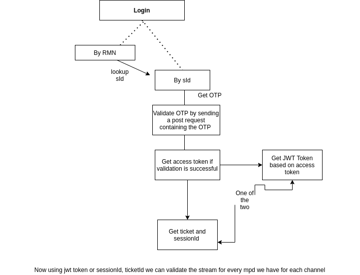

## Authentication



The above diagram explains how things work in the case of authentication in the portal

- As you can see there are two ways of logging in:
  - By Password (Deprecated after rebranding)
  - By OTP

- The `RMN` and `SID` both are required as far as the login endpoint is concerned
- After all the required parameters are sent to the API and you are successfully authenticated, you will receive a [JWT](https://jwt.io/). We make use of this JWT. This is the **Access Token**
- This access token identifies you as a unique user, and you can use this to get a valid license for each stream. This is supplied as `ls_session` in the Miscellaneous Section below

## Explanation of different files used in the code_samples directory

```allChannels.py``` - This generates a file allChannels.json containing all the channels available on the TataSky platform irrespective of whether the user has subscribed or not. The file has already been included in the repository

```constants.py``` - This is a list of urls, headers, payloads that might be used anywhere in the other files

```jwttoken.py``` - 
+ This contains the logic need for generation of the jwt . This is different from the user access Token generated by the backend upon user login. This is needed to get a license to play each channel url / mpeg dash stream /mpd file
The token generated here is appended to the license_url of each channel using ls_session key
You can find how it is done in the detailed manner in the file itself
+ This can be used independently , just specify the channelId for which you need to get the token and you are good to go
The script calls this repeatedly for all channels in the user subscribed/entitlement list

```main.py``` - This contains the logic for the menu generation for the user. It might be updated constantly
```utils.py``` - This contains the logic for the m3u generation. This will be integrated soon in the main file

## How the DASH with DRM protocol works:

I know you don't want to get into the details of how dash/hls works but this is important to know if you get lost somewhere 

+ dash files or mpd files have segments which are a list of chunks and not the entire file since these are updated on the go while a live stream is on
+ After every x seconds dash players fetch a new segment which in turn has new chunk links 
+ According to the DRM widewine policy, before fetching each chunk,
the player has to verify if the right person gets the chunk and thus a license url is always needed to verify the same

## Miscellaneous Info 

- To get a valid license take the `dashWidewineLicenseUrl` value and append to it `ls_session` where `ls_session` will be the token generated in Authentication Step 2

- For example : 
```
    dashWidewineLicenseUrl: "https://tatasky.live.ott.irdeto.com/Widevine/getlicense?CrmId=tatasky&AccountId=tatasky&ContentId=400000077"
```
and your jwt token generated in authentication endpoint number 2 is 
```eyJhbGciOiJIUzI1NiIsInR5cCI6IkpXVCIsImtpZCI6ImNvbnRyb2xfc2lnbmluZ19rZXlfcHJvZHVjdGlvbl8xNTk5MTYxMzc0NzY0In0.eyJzdWIiOiIxMjY3Nzg0MTM4IiwiaXNlIjp0cnVlLCJqdGkiOiJlNWJmMTVhZi0xNWM2LTQzNWUtYTU5MS04YjkzZjlkZmY5YmIiLCJhaWQiOiJ0Y```
Then your valid license url becomes 
```https://tatasky.live.ott.irdeto.com/Widevine/getlicense?CrmId=tatasky&AccountId=tatasky&ContentId=400000077&ls_session=eyJhbGciOiJIUzI1NiIsInR5cCI6IkpXVCIsImtpZCI6ImNvbnRyb2xfc2lnbmluZ19rZXlfcHJvZHVjdGlvbl8xNTk5MTYxMzc0NzY0In0.eyJzdWIiOiIxMjY3Nzg0MTM4IiwiaXNlIjp0cnVlLCJqdGkiOiJlNWJmMTVhZi0xNWM2LTQzNWUtYTU5MS04YjkzZjlkZmY5YmIiLCJhaWQiOiJ0Y```

## API Documentation
A rough documentation of the different endpoints used in this study can be found [here](apidoc.md)